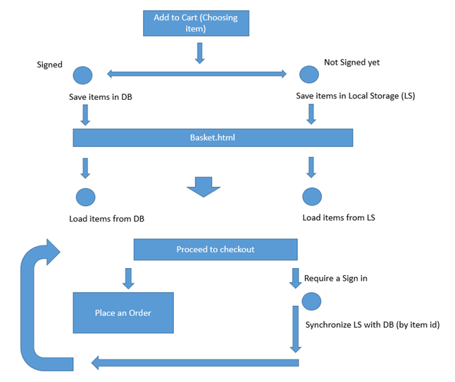

# Amazon-Clone-Mern-Stack

<h3>API Documentation Can be found at</h3>
<a target="_blank" href="https://documenter.getpostman.com/view/15294592/UVR8qTco">Amazon Clone API Docs</a>

## Backend Features
<ul>
  <li>Pagination for Products</li>
  <li>Numeric Filters for product prices</li>
  <li>Sorting Feature</li>
  <li>Select Feature for product fields</li>
  <li>Search Feature for category and name fields for product</li>
 </ul>

## Cart Feature
The below image illustrates the working of cart feature



# Technologies Used

<ul>
  <li>React Js</li>
  <li>Node Js</li>
  <li>Express Js</li>
  <li>Mongoo DB</li>
</ul>

# ```.env``` Variables
<h2>Front End </h2>

<code>REACT_APP_API_URL=</code> Enter URL your backend

<h2>Back End</h2>

<ul>
  <li><code>PORT=</code>Assign to port number of your choice</li>
  <li><code>JWT_SECRET=</code> Assign secret string for JWT</li>
  <li><code>JWT_EXPIRES_IN=</code> Assign JWT expiry time</li>
  <li><code>CONNECTION_STRING=</code> Assign MONGOO DB connection string</li>
  </ul>
<h1>Running the App</h1>

<h2>Front End</h2>
After initialising the <code>.env</code> mode to <code>amazon-frontend/</code> and run the command <code>npm install</code> and to start the application run <code>npm start</code>
<h2>Back End</h2>
  After initialising the <code>.env</code> mode to <code>backend/</code> and run the command <code>npm install</code> and to start the application run <code>node app.js</code>
